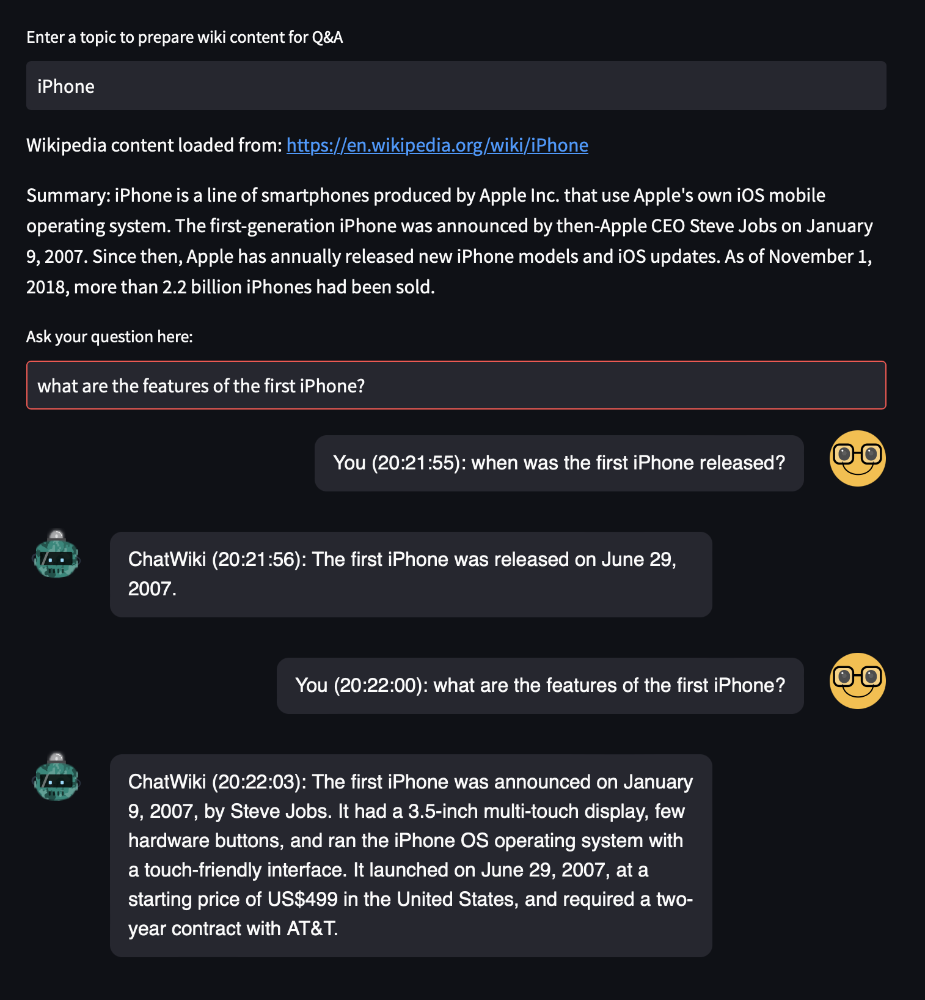

# ChatWiki

Talking with Wikipedia

## What is ChatWiki

ChatWiki is a simple Python application that utilises [embeddings](https://platform.openai.com/docs/guides/embeddings) and [langchain](https://github.com/hwchase17/langchain) to execute queries on Wikipedia content through ChatPGT. 

## Why ChatWiki

Similar to [ChatPDF](https://github.com/mlin6436/chatpdf/tree/main), it is aimed at training ChatGPT to answer questions towards specific content. 

The specific problem this project is solving is: for those who do not have ChatGPT Plus subscription, the data used to train current version of ChatGPT is up until September 2021, and it doesn't have the ability to access internet. 

This project aims to demo how to use embeddings to query live internet content using the example of Wikipedia.

## Demo



## How to run the app

### Prerequisite

You have python3 installed or run the following command to install it.
```
brew install python@3.10
```

### Install dependencies

```
pip install -r requirements.txt
```

### Retrieve your OpenAI API key

```
https://platform.openai.com/account/api-keys
```

### Insert OpenAI API key to `.env`

```
echo "OPENAI_API_KEY='your-api-key'" >> ~/.env
```

### Start the application

```
streamlit run app.py
```
